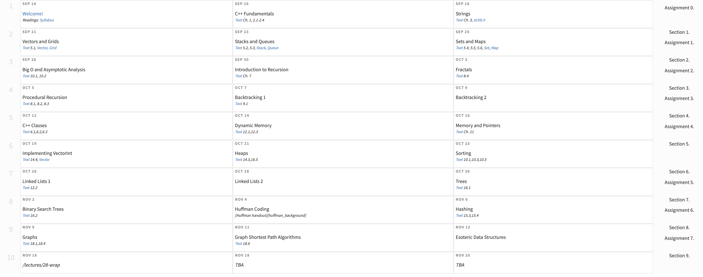

# [CS106B](http://web.stanford.edu/class/cs106b/)

## Lectures

### Assignment 0. Welcome to CS106B!
- [X] [Assignment 0](./assignments/assignment_0/)

### Lecture 2. C++ Fundamentals
-----
WEDNESDAY SEPTEMBER 16, 2020

READINGS
- [X] Text Ch. 1, 2.1-2.4

LINKS
- [X] [Slides](./lectures/lecture_2/lecture2_slides.pdf)
- [X] [Lecture Q&A]()

📦 CODE
* [intro-cpp-lecture.zip](./lectures/lecture_2/intro-cpp-lecture.zip)

### Lecture 1. Welcome!
-----
MONDAY SEPTEMBER 14, 2020

READINGS
- [X] Readings: [Syllabus](./lectures/lecture_1/syllabus.md)

LINKS
- [X] [Slides](./lectures/lecture_1/lecture1_slides.pdf)
- [X] [Lecture Q&A](./lectures/lecture_1/lecture-1-qa.md)

📦 CODE
* [WelcomeCode.zip](./lectures/lecture_1/WelcomeCode.zip)

### Lecture 0. Creating a new Qt project
-----
**Note** In order to run you must install the Stanford Library files. Follow instructions [here](http://web.stanford.edu/class/cs106b/qt/install-cs106).

* [CS106.zip](./lectures/lecture_0/CS106.zip) file

Our 📦 [sample project](./lectures/lecture_0/SampleProject.zip) is a blank/empty project can be used as a template for creating a new project with the proper CS106 settings.

