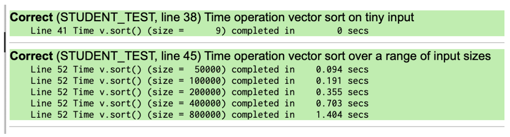
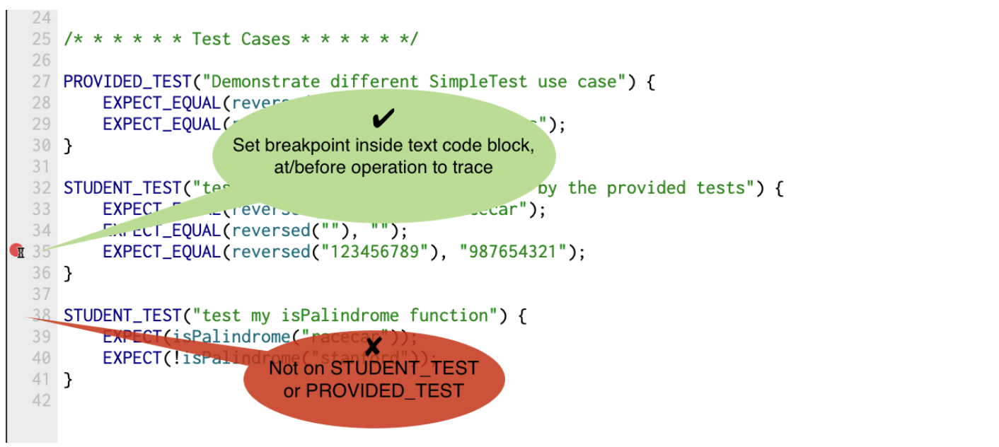

# Testing and the SimpleTest framework
## Why testing?
Anybody that writes code for some purpose (whether as a researcher, a software engineer, or in any other profession) will get to the point where others are relying on their code. Bugs in software can be [dangerous or even deadly](https://www.pingdom.com/blog/10-historical-software-bugs-with-extreme-consequences/). Additionally, users do not enjoy using software that is buggy and crashes and fixing bugs once the software is in production is very costly. Most importantly, **good engineers take pride in building things that work well and are robust**.

The key to writing working software is developing good tests. In this course we follow an approach called test-driven development. As you write code, you will also write companion tests. These tests are used to verify that the code you just finished writing works as intended.

This strategy is sometimes called "test-as-you-go". You work in small steps, being sure to test thoroughly, and only move on after you having confirmed the correctness and fixed all issues. The beauty of this approach is that each step is relatively straightforward and easy to debug. Imagine the opposite approach: you write hundreds of lines of code, the code does not work, and now you need to figure out which one of those hundreds of lines of code isn't working as expected! That is the sort of frustration that we want to help you all avoid as you continue to develop your skills as programmers.

## SimpleTest
For CS106B, we provide a unit-test framework called **SimpleTest** that you will use to test your code. This framework was pioneered by our ace colleague Keith Schwarz. **SimpleTest** provides a simple, clean approach to writing and running test cases.

Here is an example of how you might see the **SimpleTest** framework used in the starter code of an assignment.
```cpp
// reversed(str) returns copy of str with characters in reverse order.
string reversed(string s)
{
    string result;
    for (int i = s.length() - 1; i >= 0; i--) {
        result += s[i];
    }
    return result;
}

/* * * * * * Test Cases * * * * * */

PROVIDED_TEST("Demonstrate different SimpleTest use cases") {
    EXPECT_EQUAL(reversed("but"), "tub");
    EXPECT_EQUAL(reversed("stanford"), "drofnats");
}
```
When we provide tests for you in the starter code, each test case is wrapped in the special macro **PROVIDED_TEST**. The string argument in parentheses describes the purpose of the test and the code block that follows (enclosed in curly braces) defines the actual test behavior.

When you add your own test cases, you will wrap your test code blocks in the **STUDENT_TEST** macro instead. The **STUDENT_TEST** functionality and structure is exactly the same as **PROVIDED_TEST**, it simply distinguishes the tests you've written yourself from those we provide for the benefit of your grader. You will see many examples of this in the following sections.

### EXPECT_EQUAL
Within the code block, the test macro most commonly used is **EXPECT_EQUAL** which confirms the two arguments are equal. A typical use case for **EXPECT_EQUAL** is to take a value produced by your code, e.g. the return value from a call to one of your functions, and confirm that value matches to the expected outcome. For example, in the above code, **EXPECT_EQUAL** is used to compare the result of the call **reversed("but")** to the string **"tub"**. If the two are indeed equal, the test passes. If they do not match, the test is reported as a failure.

For example, after adding your own tests (using the **STUDENT_TEST** identifier as previously mentioned) to the above file, it could look something like this:
```cpp
// reversed(str) returns copy of str with characters in reverse order.
string reversed(string s)
{
    string result;
    for (int i = s.length() - 1; i >= 0; i--) {
        result += s[i];
    }
    return result;
}

/* * * * * * Test Cases * * * * * */

PROVIDED_TEST("Demonstrate different SimpleTest use cases") {
    EXPECT_EQUAL(reversed("but"), "tub");
    EXPECT_EQUAL(reversed("stanford"), "drofnats");
}

STUDENT_TEST("my added cases not covered by the provided tests") {
    EXPECT_EQUAL(reversed("racecar"), "racecar");
    EXPECT_EQUAL(reversed(""), "");
    EXPECT_EQUAL(reversed("123456789"), "987654321");
}
```
`
Important note: You should never modify the provided tests – these are the same tests that will be used for grading, so it is not in your best interest to modify them. If you want to test different scenarios, always add new tests using the STUDENT_TEST macro.
`
### EXPECT
Another test macro that is regularly used is the **EXPECT** which confirms the truth of a single expression. If the expression evaluates to true, the test passes. If false, it reports a test failure. For example, if you added the **isPalindrome** function to the above program, you could add a test case that uses **EXPECT** to confirm the correct result from **isPalindrome**, as shown below.
```cpp
// reversed(str) returns copy of str with characters in reverse order.
string reversed(string s) {
    string result;
    for (int i = s.length() - 1; i >= 0; i--) {
        result += s[i];
    }
    return result;
}

bool isPalindrome(string s) {
    return s == reversed(s);
}

/* * * * * * Test Cases * * * * * */

PROVIDED_TEST("Demonstrate different SimpleTest use case") {
    EXPECT_EQUAL(reversed("but"), "tub");
    EXPECT_EQUAL(reversed("stanford"), "drofnats");
}

STUDENT_TEST("test additional cases not covered by the provided tests") {
    EXPECT_EQUAL(reversed("racecar"), "racecar");
    EXPECT_EQUAL(reversed(""), "");
    EXPECT_EQUAL(reversed("123456789"), "987654321");
}

STUDENT_TEST("test my isPalindrome function") {
    EXPECT(isPalindrome("racecar"));
    EXPECT(!isPalindrome("stanford"));
}
```
When would you use **EXPECT** instead of **EXPECT_EQUAL**? **EXPECT_EQUAL** which is appropriate for any situation in which you have two values that can be compared for equality (two numbers, two strings, two Vectors, etc.). **EXPECT** allows you to express a wider variety of conditions beyond simple equality. For example, you could confirm the truth of a complex set of conditions by passing a compound expression such as **EXPECT(x > y && y != z || y == 0);**

### EXPECT_ERROR
You pass an expression to **EXPECT_ERROR** and it evaluates the expression and observes whether it calls the **error()** function to report an error. If an error is raised, this causes the test to pass. If not, it causes the test to fail and reports that the expression failed to trigger an error. **EXPECT_ERROR** is used in the specific situation of confirming expected handling of errors within your code.

### EXPECT_NO_ERROR
This macro is exactly the opposite of **EXPECT_ERROR**. With this macro, you pass it an expression, and if the expression successfully runs to completion without running an error, then the test passes. However, if evaluating the expression calls the error() function somewhere along the way, the error causes the test case to report failure. **EXPECT_NO_ERROR** is used in specific situations where you want to confirm that functions behave properly on correct input.

### TIME_OPERATION
**SimpleTest** also has support for simple execution timing.

To time an operation, evaluate the expression within the macro **TIME_OPERATION(size, expression)**, as shown below:
```cpp
STUDENT_TEST("Time operation vector sort on tiny input")
{
    Vector<int> v = {3, 7, 2, 45, 2, 6, 3, 56, 12};
    TIME_OPERATION(v.size(), v.sort());
}
```
The first argument to **TIME_OPERATION** is the input size; this is used to label this timing result to distinguish from other results. The second argument is the expression to evaluate. **TIME_OPERATION** will start a new timer, evaluate the expression, stop the timer, and report the elapsed time.

You can have more than one use of **TIME_OPERATION** within a test case. Each operation is individually evaluated and timed. Below demonstrates use of **TIME_OPERATION** in a loop to time sorting successively larger vectors.
```cpp
STUDENT_TEST("Time operation vector sort over a range of input sizes")
{
    for (int size = 50000; size < 1000000; size *= 2) {
        Vector<int> v;
        for (int i = 0; i < size; i++) {
            v.add(randomInteger(1, 1000)); // fill vector with random values
        }
        TIME_OPERATION(v.size(), v.sort());
    }
}
```
Here are the test results for running the test cases above:

Using **TIME_OPERATION** over a range of sizes lets you see how the time required changes with respect to input size, i.e. predicts the algorithm's Big O. Handy!

By default, a test case that uses **TIME_OPERATION** will be reported as **Correct** as long as the expression being evaluated does not result in an error or crash. If you want to verify the actual correctness of the result as well as time it, you can mix in regular use of **EXPECT_EQUAL** and **EXPECT** into the test case as shown below:
```cpp
STUDENT_TEST("Time operation vector sort on tiny input and verify is sorted")
{
    Vector<int> v = {3, 7, 2, 45, 2, 6, 3, 56, 12};
    TIME_OPERATION(v.size(), v.sort());
    EXPECT(checkIsSorted(v));
}
```

#### runSimpleTests
The **main** program of every project will be configured so that you have three choices every time you want to run your program: run all the tests, run a selected portion of the tests, or run no tests at all and proceed with normal execution of the program. The way that you can control this is demonstrated below:
```cpp
int main()
{
    if (runSimpleTests( <test choice argument> ))
        return 0;
    ... 
}
```
The argument to **runSimpleTests** is either:

* **NO_TESTS** (skip testing altogether, just run rest of normal **main** function)
* **ALL_TESTS** (run all tests for all files)
* **SELECTED_TESTS** (provide menu to select which file to run tests)

#### Debugging a failing test
The goal you are shooting for is for all of your tests to pass. However, if you get a failed test result, don't look at this as sad times, this test result is news you can use. The failing test case indicates that you have identified a specific operation that behaves counter to your expectations. This means you know where to focus your attention.

Dig into that test case under the debugger to analyze how it has gone astray. Set a breakpoint inside the text code block, and choose to stop at the line that is at or before the failing **EXPECT/EXPECT_EQUAL** statement.

Now run the tests under the debugger. When the program stops at the breakpoint, single step through the code while watching in the variables pane to observe the changing state of your variables, using a technique just like you did in the [debugging tutorial](./DebuggerTutorial.pdf) in Assignment 0.

After you understand the failure and apply a fix, run that test again. When you see the test now pass, you can [celebrate having squashed that bug](http://phdcomics.com/comics/archive.php?comicid=180)!

## Test-driven development
We highly recommend employing test-driven development when working on your assignments. To do so, follow these steps:

* identify a small, concrete task (bug to fix, feature to add, desired change in behavior)
* construct tests for the desired outcome, add them to the file in which you're currently working, and verify the current code fails these tests
* implement the changes in your code to complete the task
* re-run your newly added tests and verify they now succeed
* test the rest of the system (by running all tests) to verify you didn't inadvertently break something else

You change only a small amount of code at once and validate your results with carefully constructed tests before and after. This keeps your development process moving forward while ensuring you have a functional program at each step!

## Test cases and grading
The **SimpleTest** framework will be supplied with each assignment, and there will be some initial test cases provided in the starter project, but you will also be expected to add your own tests.

You will submit your tests along with the code, and the grader's review will consider the quality of your tests. We will also provide comments on your tests to help you improve your testing approach. Please incorporate our feedback into future assignments; it will improve your grade and, more importantly, your effectiveness as a programmer. We guarantee future employers will appreciate your ability to write good tests and well-tested code!

Here are some things we look for in good tests.
* Are the tests comprehensive? Is all the functionality tested?
* Where possible, are the tests self-contained and independent?
* Did you anticipate potential problems, tricky cases, on boundary conditions?
* Did you develop the tests in a good order? Did you test basic functionality before more advanced functionality? Did you take small, carefully chosen steps?

## Common questions
Should each **EXPECT/EXPECT_EQUAL** be in a **STUDENT_TEST** code block of its own or can I list several within one code block?

For tests that are closely related, it may be convenient to group them together in the same code block under one test name. The tests will operate as one combined group and show up in the report as one aggregate success (if all pass) or one failure (if at least one fails).

However, there are advantages to separating each individual test case into its own code block. You will be able to choose a clear, specific name for this block. The separation isolates each test so you can easily identify exactly which cases are passing and which are failing. For example if you have
```cpp
STUDENT_TEST("Many tests together"){
    EXPECT(... Test A ...)
    EXPECT(... Test B ...)
    EXPECT(... Test C ...)
}
```
then if Test B fails, Test C will never run and you won't be able to see the output – you won't know if Test C passed or failed. On the other hand, if you structure your tests like this
```cpp
STUDENT_TEST("Test A"){
    EXPECT(... Test A ...)
}

STUDENT_TEST("Test B"){
    EXPECT(... Test B ...)
}

STUDENT_TEST("Test C"){
    EXPECT(... Test C ...)
}
```
then all the tests will run individually, and even if Test B fails, you will still get independent information about Tests A and C. Having this sort of isolated behavior might make debugging any problems you encounter a little bit easier!

### What happens if my test case is bogus or malformed?
When testing your code, you should construct each test case so that a correct implementation will pass (receive a "CORRECT"). A test case that been written to "fail" given a correct implementation is considered "bogus". If a test case is bogus, it is usually asking the wrong question.

Suppose you have written an **isEven** function to determine if a number is even and you wish to test its correctness. You have written the bogus test case below that is designed to fail if the **isEven** function returns false on a odd input.
```cpp
STUDENT_TEST("Test isEven() on odd numbers should fail") {
    EXPECT(isEven(3));
}
```
If you run the above test on a correct implementation of **isEven**, the test will fail and the result is reported as "INCORRECT". The only way to "pass" this test would be with a broken implementation of **isEven**. Confirming whether your function is actually correctness becomes very confusing if your test case is bogus.

Instead, you want to ask the question, "Does **isEven** return true for an even number?" and "Does **isEven** return false for an odd number?" The tests below are correct ways to test for both true and false results.
```cpp
STUDENT_TEST("Test isEven() on even number should return true") {
    EXPECT(isEven(8));
}

STUDENT_TEST("Test isEven() on odd number should return false") {
    EXPECT(!isEven(13));
}
```
Both of these tests will pass for a correct implementation of **isEven**. In short, make sure to design your tests to pass not fail to demonstrate that your code is working.

